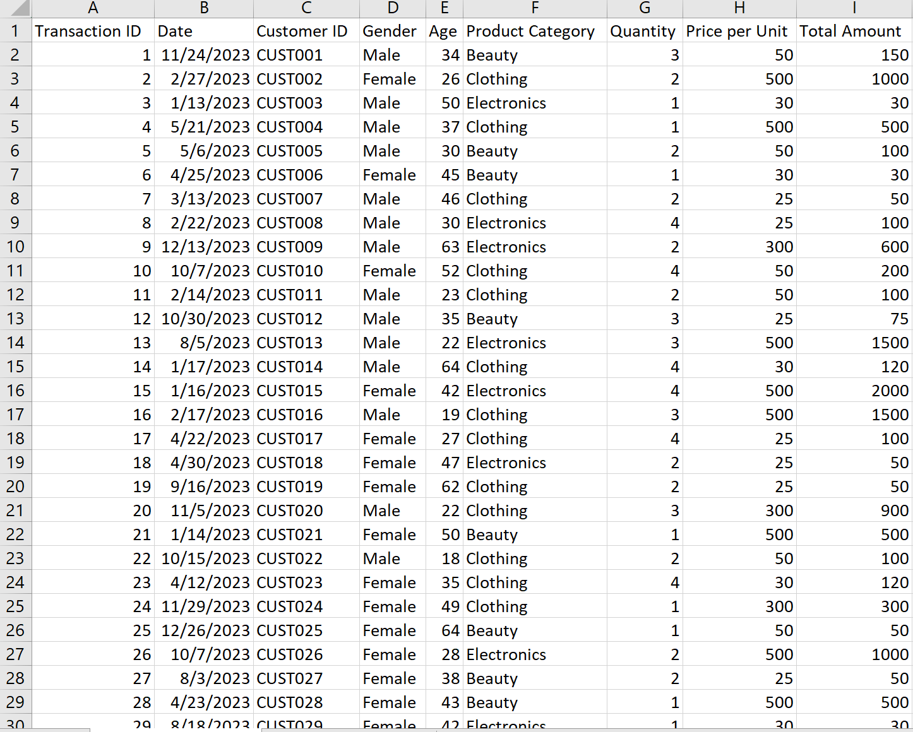
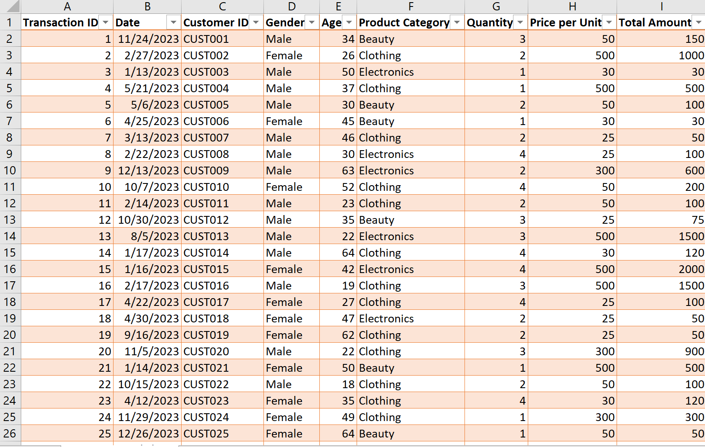
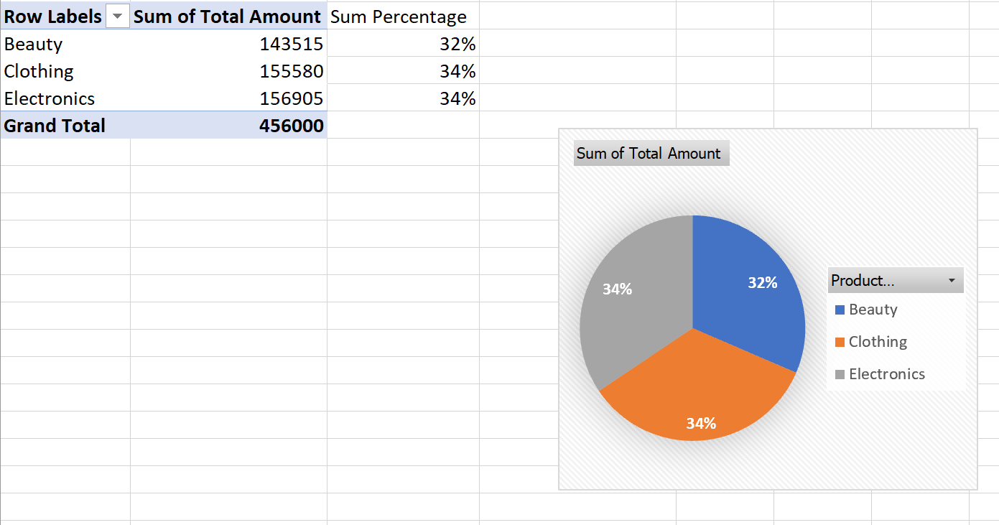
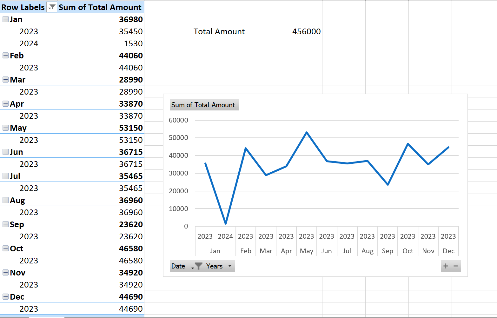
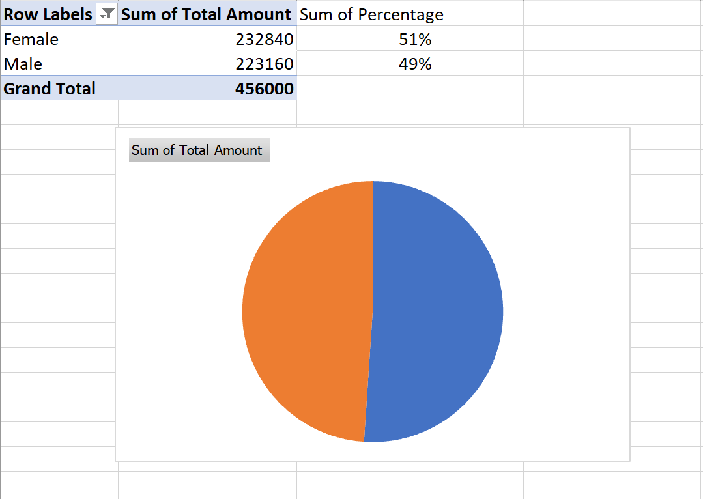
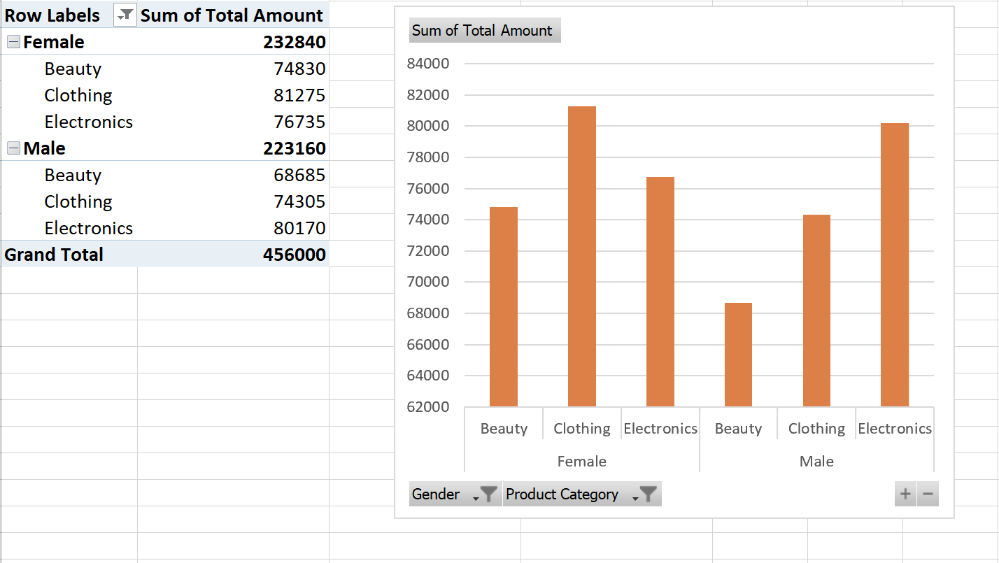

# -Interactive-Retail-Sales-Analysis-With-Excel-

## About Dataset

The dataset includes information on the Transaction ID,	Date,	Customer ID,	Gender,	Age,	Product Category,	Quantity,	Price per Unit and Total Amount
of a Supermarket. This data has been provided to assist the Supermarket in generating monthly insights about their businesses, enabling them to make informed decisions.

## Aim
I opted to utilize Microsoft Excel for all phases of this project as it serves as an easily accessible spreadsheet software, offering a comprehensive platform for data cleaning, analysis, and visualization.

## The Process

- The dataset was provided in Excel format, simplifying the import process.
- Although there were no missing values, the dataset was organized into a table format and it also underwent systematic review for accuracy and completeness.

## Interactive Dashboard

**Within this project, I've exhibited the adept utilization of:**

- *Format Data in Table*

- *Create Pivot table and Pie chart for Sales by Category*

- *Create Pivot table and Line graph for Sales by Month*

- *Create Pivot table and Pie chart for Sales by Gender*

- *Create Pivot table and Column chart for Sales by Gender and Category*

## Analysis Insights

- Clothing and Electronics both contributed 34% each to the total sales percentage, showing an equal share.
 
- The year 2023 had the highest number of sales in the month of February with 44,060.
 
- The year 2024 had the lowest number of sales, in the month of January with 1,530.
 
- The female segment outperforms the male segment in sales by a margin of 2%.
 
- Clothing sales were notably higher among females, whereas males excelled in Electronics. However, both genders experienced the lowest sales in beauty products.

  ## Recommendation

- Given the equal contribution of Clothing and Electronics to total sales, allocating marketing efforts and resources equally between these two product categories can be considered to maintain balance and capitalize on consumer interest.

- With February of 2023 recording the highest sales, exploring the factors contributing to this peak period and considering replicating successful strategies during similar periods will maximize sales potential.

- Factors contributing to the lowest sales in January 2024 can be checked and strategies  implemented to mitigate similar declines in the future. 

- Marketing campaigns can be tailored to target the preferences of different gender segments. 
  
- Despite the lower sales in beauty products across both genders, market research can be conducted to understand consumer preferences and potential barriers to purchase.

## Conclusion 

The analysis of sales data has provided valuable insights into product performance, seasonal trends, and gender-specific preferences. By leveraging these insights to tailor marketing strategies and address areas of opportunity, businesses can enhance sales performance and better meet the needs of their target audience. Conducting further research and implementing strategic adjustments will be essential for sustaining growth and maximizing profitability in the future.

